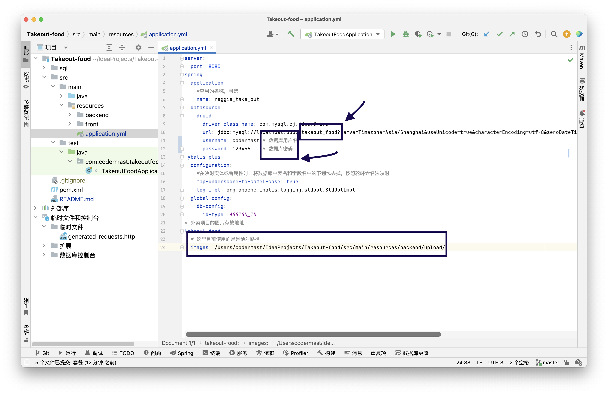

# 🔱项目介绍
&emsp;&emsp;本项目是基于SpringBoot+MySql+Mybatis Plus技术的一个前后端分离的外卖管理系统。

## 🔷使用技术
- SpringBoot
- MySql
- Mybatis Plus

## 资料下载

- 后端API思维导图：Xmind格式
- SQL文件：

## ❤️‍🩹开发进度
### V1版本
> V1版本的后台功能已经开发完毕，就剩前台的API还没有开发完毕。
- 🔺后台
  - [x] 登录模块
  - [x] 员工管理
  - [x] 分类管理
  - [x] 菜品管理
  - [x] 套餐管理
  - [x] 订单管理
- 🔻前台

## 项目部署

1. 下载本项目到服务器。

2. 修改`src/main/resources/application.yml`文件内的数据库信息
> 需要改动的就是下面我勾选的三个地方

  - 数据库名
  - 数据库用户名
  - 数据库密码
3. 在服务器上部署时，将项目打成`jar`包，使用`java -jar 包名`进行运行
4. 访问localhost:8080/backend/index.html即可
## 参考教程

- 笔记整理：CSDN-[https://blog.csdn.net/qq_33685334](https://blog.csdn.net/qq_33685334)

- 视频教程：黑马程序员-瑞吉外卖项目[https://www.bilibili.com/video/BV13a411q753](https://www.bilibili.com/video/BV13a411q753)
